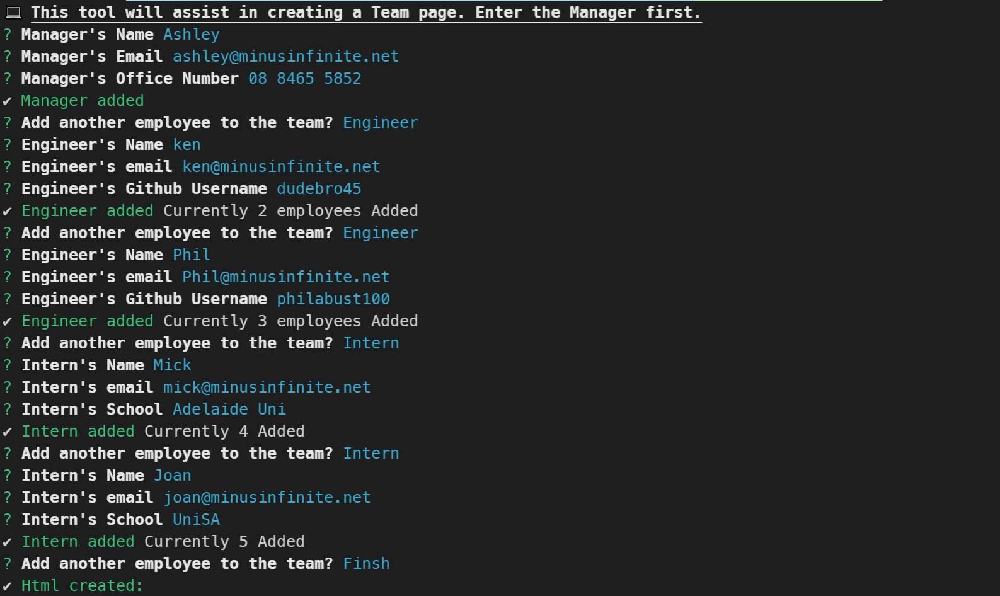
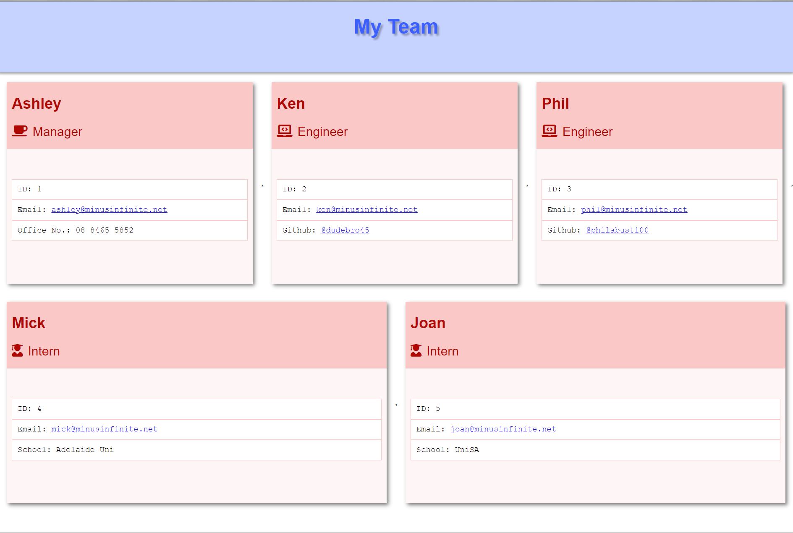

# My Team CLI

A Command Line Tool to quickly generate a landing page for you team

## Table of Contents

[Installation](#installation)

[Usage](#usage)

[Examples](#examples)

[Credits](#credits)

[Testing](#testing)

[Questions](#questions)

## Installation

Clone the repo

```termnal
git clone https://github.com/minusInfinite/my-team-cli.git
```

Install packages via Yarn - <https://yarnpkg.com/>

```termnal
yarn install
```

## Usage

Use the following NPM script

```termnal
yarn start
```

## Examples

[Video demo](https://youtu.be/wGfslArMGAU)





## Credits

InquirerJS - <https://github.com/SBoudrias/Inquirer.js>

Chalk - <https://github.com/chalk/chalk>

## Testing

A number of tests have been written for the exisiting classes.
If you need to add addtional Employee types be sure to add tests.

Then run the command below

```terminal
yarn test
```

Unit-tests in this projects is done using jest - <https://jestjs.io/>

## Questions

Github: @minusInfinite

[Email](mailto://ashley@minusinfinite.net)
